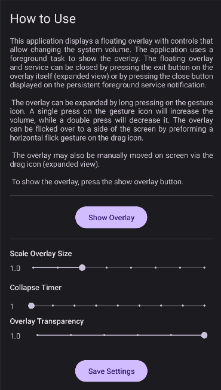

# About

**Floating Overlay**

**Supported Android Versions:** 28 (Android 9 / Pie) - 34 (Android 14 / Upside Down Cake)

Repository contains source code of the Floating Overlay Android app. The app
shows an overlay on the screen (drawn on top of other apps), that allows changing
the current relevant system volume through gestures (single/double tap on the
overlay), or pressing on the overlay buttons (when expanded).

The most relevant volume is modified, which depends on what the phone is currently
doing. For example, if music is playing, the overlay will increase/decrease the
playback volume. If no music is playing, the overlay will change the background
or system volume.

*NOTE:* Some features, such as dynamic / material 3 colours, are only available
in more recent versions of the Android operating system!

## Required Permissions

This application requires three permissions to function:
* Foreground Service Permissions - The app uses a foreground service to show an
overlay on the screen.
* Notification Permissions - A persistent notification (dismissible on modern
versions of Android) that indicates when the service/overlay is active.
* Draw on top of Apps - The app uses this permissions to show the floating
overlay.

## Guide

When opening the application (on resume), the main activity will check if all
the required permissions have been granted. If permissions are missing a the
permission check screen is started to explain to the user what permissions are
needed, and prompt the user to grant them.

### Permission Check Screen

The permission check activity shows a simple grid with all the permissions that
the application requires, along with an explanation of how the permissions are
used once granted.

The button on the bottom of the page displays the relevant grant permission
prompt or settings (used to grant the draw-over-other apps permissions).

If you decide to not grant the requested permissions, you may exit the application
by pressing the back button. Please note that all required permissions are
mandatory and you will not be able to use the application without granting them!

After all permissions have been granted, the permission check activity will
automatically terminate and display the Main Activity of the application.

### Main Screen

The main application screen contains a brief explanation of the app and its features,
followed by a show overlay button. Pressing the show overlay button will start
the foreground service and display the floating overlay on screen.

*NOTE:* A persistent notification is shown to indicate when the foreground service
is running and the overlay is visible on screen.

After the show overlay button, there is a section with controls (slider bars)
that allows configuring the following attributes of the overlay:
* Scale factor. Overlay can be scaled from a factor of 0.6 (made smaller) up to
a factor of 2.0 (made larger) in increments of 0.2.
* Collapse timer value. The collapse timer controls how quickly the overlay
collapses after it has been expanded to reveal the extra controls.
* Overlay transparency. The overlay can be made 90% transparent (0.1 alpha factor)
up to fully opaque (1.0 alpha factor) in increments of 20% (0.2 alpha).

After the overlay configuration controls, the main activity contains a save
settings button that save and apply the preferences to the overlay. If the
overlay is currently visible, pressing the button will immediately apply
the new UI attributes.

### Floating Overlay UI

The floating overlay is coloured horizontal square with five buttons:
1) A gesture indicator / button - allows performing gestures when minimized
2) A drag handle / button - allows moving the overlay on screen to a custom location
3) A decrease volume button
4) An increase volume button
5) A close overlay button - stops the foreground service and hides the overlay

In collapsed mode (shown by default), the overlay will show only the gesture
indicator. To expand the overlay, the user can press and hold on the gesture
icon.

*NOTE:* Expand and flick gestures can only be performed when the overlay is
collapsed.

The following gestures are supported by the overlay (performed on the gesture icon):
* Single press - lower system volume
* Double press - increases system volume
* Press and Hold - expand overlay
* Flick - move the overlay to the corner of the screen based on the flick direction.

*Collapsed preview of overlay (dynamic colours dark green):*

*Expanded preview of overlay (dynamic colours dark green):*

## Showcase

This section showcases the UI and functionality of the application.

### Icons

*Light Mode Dynamic Colours:*

*Dark Mode Dynamic colours:*

### Permission Check Activity

### Main Activity

